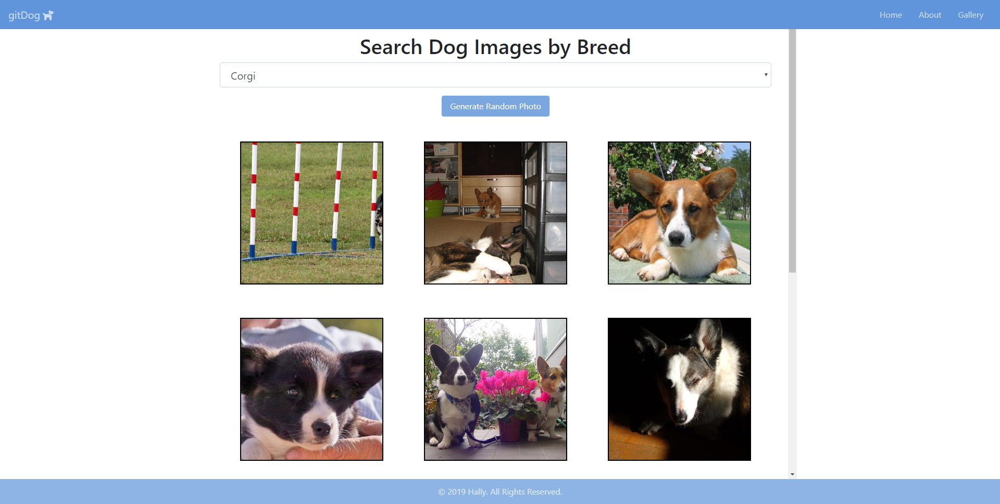

# gitDog Engine

Do you like dogs? Here is a website that you can check on all types of breed. You can even choose to see some random images of any dog you like. Here, I made this website to practice and to learn using ***pug***.

## :open_file_folder: Files

```
gitDogEngine
├─ .gitignore
├─ node_modules
├─ package-lock.json
├─ package.json
├─ README.md
├─ screenshots
│  ├─ img-0.png
│  ├─ img-1.png
│  ├─ img-2.png
│  └─ img-3.png
├─ server.js
└─ views
   ├─ about.pug
   ├─ assets
   │  └─ images
   │     ├─ dog-0.png
   │     ├─ dog-1.png
   │     ├─ img-0.jpg
   │     ├─ img-1.jpg
   │     └─ img-2.jpg
   ├─ gallery.pug
   ├─ index.pug
   ├─ main.js
   └─ style.css

```

## Technologies
- JavaScript 
  - Nodejs
  - jQuery
  - express
- Bootstrap
- Google Fonts
- Fontawesome
- Heroku
- pug
- [Dog API](https://dog.ceo/dog-api/)


## Install
To clone this project to your device, type the `code` below to your git bash:
```bash
git clone https://github.com/itshally/gitDogEngine.git
```

Then, type the code to run the project:
```bash
cd gitDogEngine
npm install
```

## Usage
It's being deployed on Heroku.

Make sure you have a Heroku account. If you have one:
- Create a new app and name it whatever you want as long as it is available, but leaving the input field for the **App name** empty is still fine because it will automatically generate one for you.
- Make sure that in your **Settings** tab, you have your `heroku/nodejs` buildpack added.
- Then in your **Deploy** tab, you can connect your Github and search for your repository. Click the **Automatic Deploys** button and then click the **Deploy branch** button below. The default branch is **master**.

## Screenshots
Here is an available screenshot:

- This is the home page
	

- This is the about page
	

- When the user clicks the dropdown, they will see all the listed types of breed.
	

- Once they clicked the ***Generate Random Photo***, 12 images will display.
	
	
## Demo
Click this [live preview](https://gitdog-engine.herokuapp.com/) to see this page.

## Author
[@itshally](https://github.com/itshally) 
